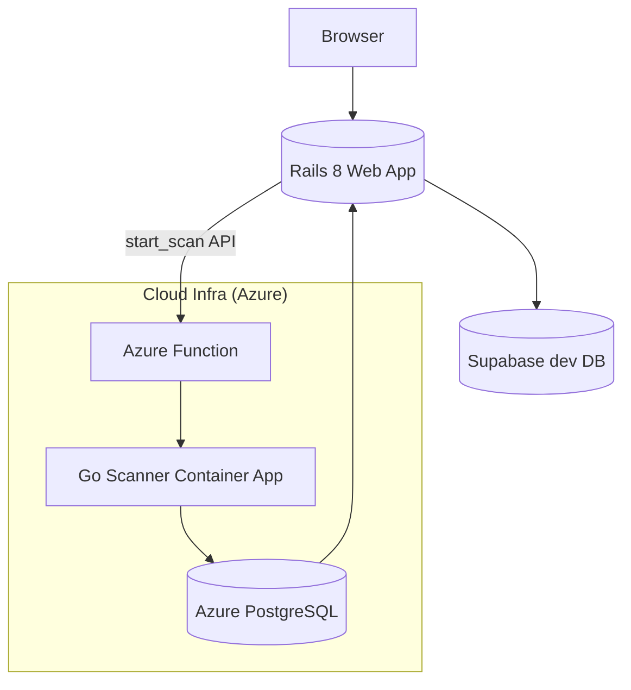

# AllSafeASM Web Application 🚀

[](https://rubyonrails.org/)  
[](https://www.postgresql.org/)  

> "Know your attack surface, before the adversary does."

AllSafeASM is a cloud-native, AI-enhanced **Attack Surface Management (ASM)** platform that empowers security teams to continuously discover, monitor and secure their external assets.  
This repository contains the **primary web application**—the user-facing interface built with Ruby on Rails 8 and Hotwire.

---

## 📚 Table of Contents
1. [Features](#features)
2. [Technology Stack](#technology-stack)
3. [Architecture Overview](#architecture-overview)
4. [Getting Started](#getting-started)
   1. [Quick Start (Docker)](#quick-start-docker)
   2. [Manual Setup](#manual-setup)
5. [Usage](#usage)
6. [Roadmap](#roadmap)
7. [Contributing](#contributing)
8. [Authors](#authors)

---

## ✨ Features

### Implemented
- 🔐 **User Authentication & Authorization**  
  - Email & password registration / login  
  - Social login with **Google** & **GitHub** (OmniAuth)  
  - Secure password hashing with `bcrypt`
- 📝 **Profile & Account Management**

### Upcoming
- 📦 **Project & Asset Management** (domains)  
- ⚡️ **Scanner Micro-Service Integration** (Cloud infrastructure on Azure)  
- 📈 **Real-time Dashboard** with live scan status (Action Cable & Solid Cable)  
- 📊 **Interactive Vulnerability Visualizations**  

---

## 🛠️ Technology Stack

| Layer      | Technology |
|------------|------------|
| Backend    | **Ruby on Rails 8** |
| Frontend   | **Hotwire** (Turbo & Stimulus) |
| Styling    | **Tailwind CSS** |
| Database   | **PostgreSQL** (Supabase for development, Azure Database for PostgreSQL in production) |
| Auth       | Native Rails + **OmniAuth** (Google, GitHub) |
| Realtime   | **Action Cable** + **Solid Cable** adapter (dev & prod) |

---

## 🏗️ Architecture Overview



* **Rails App:** Authenticates users, manages projects/assets and triggers scans by calling the `start_scan` Azure Function, while streaming real-time updates via **Solid Cable**.
* **Azure Function (`start_scan`):** Kicks off the Go-based scanner running inside Azure Container Apps.
* **Go Scanner Container App:** Executes enumeration & vulnerability scans and writes progress/results back to the database.
* **Database:** **Supabase** (development) or **Azure PostgreSQL** (production) stores users, assets, and scan data.

---

## 🚀 Getting Started

### Quick Start (Docker)
> Ideal if you just want to explore the app without installing Ruby or PostgreSQL locally.

```bash
# Clone & launch the stack
$ git clone https://github.com/AllsafeASM/webapp.git && cd webapp
$ bin/rails credentials:edit --environment development   # add your secrets (see below)
$ docker compose up --build

# Visit the app
# http://localhost:3000
```

### Manual Setup

#### 1. Prerequisites
- **Ruby ≥ 3.3.0** & **Rails 8**
- **PostgreSQL ≥ 14** client libraries (`libpq`)
- **Bundler**: `gem install bundler`

#### 2. Install Dependencies
```bash
bundle install
```

#### 3. Configure Rails Credentials
We use **Rails Encrypted Credentials** instead of `.env` files. Run the command below and add the needed keys:

```bash
bin/rails credentials:edit --environment development
```

Sample (`YAML`) structure:

```yaml
# config/credentials/development.yml.enc (after editing)
db_dev:
  host: "YOUR_HOST"
  port: 5432
  user: "YOUR_USER"
  passwd: "YOUR_PASSWORD"
  name: "YOUR_DB_NAME"

# Production settings (edit with `--environment production`)
db_prod:
  host: "YOUR_AZURE_HOST"
  port: 5432
  user: "YOUR_AZURE_USER"
  passwd: "YOUR_AZURE_PASSWORD"
  name: "YOUR_AZURE_DB_NAME"

# API key used to trigger Azure Function
api_key: "YOUR_AZURE_FUNCTION_API_KEY"

# Social login
google:
  client_id: "YOUR_GOOGLE_CLIENT_ID"
  client_secret: "YOUR_GOOGLE_CLIENT_SECRET"
github:
  client_id: "YOUR_GITHUB_CLIENT_ID"
  client_secret: "YOUR_GITHUB_CLIENT_SECRET"
```

(Remember to keep your `RAILS_MASTER_KEY` safe so the app can decrypt credentials.)

#### 4. Database Setup
```bash
rails db:create db:migrate db:seed
```

#### 5. Run the Application
```bash
bin/rails s            # http://localhost:3000
```

---

## 🧑‍💻 Usage
1. Register or log in (Google / GitHub supported).
2. Create a **Project** and add your assets.
3. Click **Start Scan**—AllSafeASM queues a job for the Go scanner.
4. Watch live scan progress on the dashboard.

---

## 🗺️ Roadmap
- [ ] Finish CRUD for projects & assets
- [ ] Integrate Go scanner micro-service
- [ ] Action Cable live updates
- [ ] Rich vulnerability dashboard & reporting
- [ ] Role-based access control (RBAC)

---

## 🤝 Contributing
Pull requests are welcome! For major changes, please open an issue first to discuss what you would like to change.

```bash
# Lint & run tests (coming soon)
$ bundle exec rake
```
1. Fork the repository.
2. Create your feature branch: `git checkout -b feature/awesome-feature`.
3. Commit your changes: `git commit -m 'feat: add awesome feature'`.
4. Push to the branch: `git push origin feature/awesome-feature`.
5. Open a Pull Request.

---

## ✍️ Authors
- **Abdelrahman Magdi** – [abdomagdi300@gmail.com](mailto:abdomagdi300@gmail.com)
- **Omar Essam** – [omar.e.gado@gmail.com](mailto:omar.e.gado@gmail.com)
- **Hazem Osama** – [hazemosama681@gmail.com](mailto:hazemosama681@gmail.com)

Made with ❤️ as a part of the AllSafeASM graduation project at **Faculty of Engineering, Port Said University**.